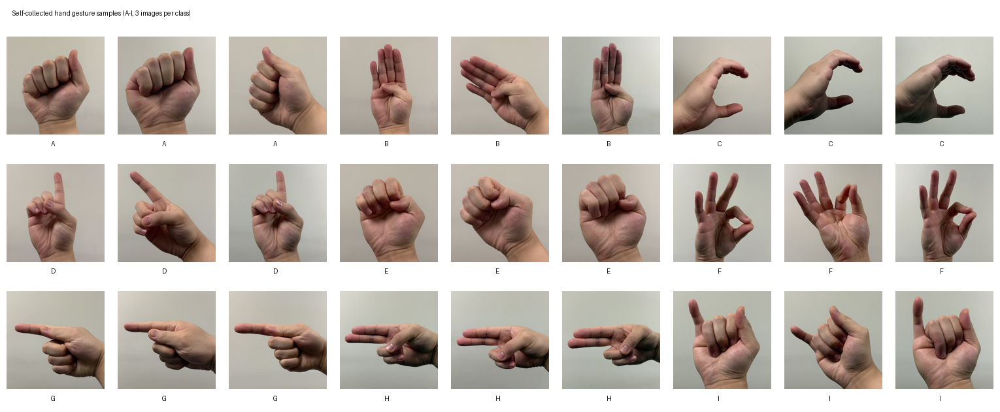
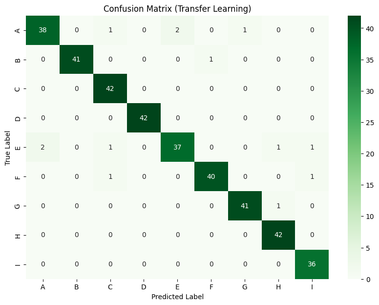
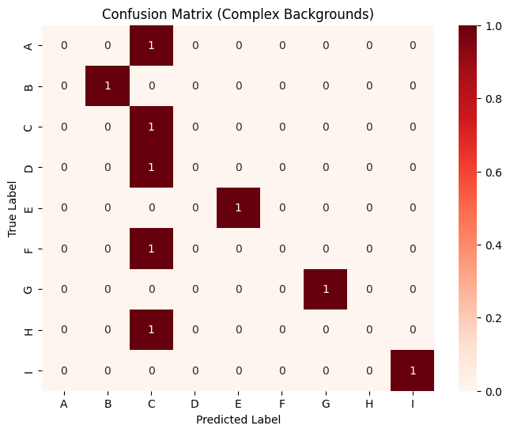

#  Hand Gesture Recognition with Transfer Learning (American Sign Language)

Computer-vision workflow for 9-class hand gesture recognition using custom CNNs, self-collected images, AlexNet feature extraction, and ResNet18 transfer-learning comparison.

## Preview

**Figure 1.** Self-collected A-I gesture samples used to evaluate real-world model generalization.

**Figure 2.** Confusion matrix for the AlexNet transfer-learning classifier on the held-out gesture test set.

**Figure 3.** Complex-background stress-test confusion matrix showing how performance changes under domain shift.

## Project summary

This project builds a hand gesture classifier for nine gesture classes labeled A-I. The workflow includes subject-aware train/validation/test splitting, a custom CNN baseline, hyperparameter tuning with regularization, transfer learning using pretrained AlexNet features, comparison against ResNet18 features, evaluation on self-collected images, and prediction generation for an unlabeled test set.

## Problem

This project aims to complete two major computer-vision components:

> 1. Gather a small personal image dataset of hand gestures and understand the challenges involved in data cleaning.
> 2. Train convolutional neural networks to classify different hand gestures, then use transfer learning from pretrained image models to improve classification performance.

The workflow also tests models on new data that was not part of training, compares custom CNNs with pretrained feature extractors, and discusses robustness issues such as domain shift, backgrounds, lighting, and real-world bias.

## Data

- revised hand gesture image dataset with 2,432 labeled images
- subject-aware split with no person overlap across training, validation, and test sets
- train/validation/test split of 1,685 / 375 / 372 images
- nine target classes: `A` through `I`
- 27 self-collected gesture images, with three images per class
- 1,000 unlabeled images for final prediction output

## Techniques

- PyTorch image dataset loading and transforms
- subject-based splitting with `GroupShuffleSplit`
- custom CNN architecture for gesture classification
- early stopping based on validation loss
- dropout and weight-decay regularization
- confusion-matrix evaluation
- AlexNet pretrained feature extraction
- ResNet18 pretrained feature extraction
- transfer-learning classifier heads
- domain-shift analysis on self-collected and complex-background images

## Achievements

- created a leakage-aware split by subject ID rather than random image-level shuffling
- implemented and sanity-checked a custom CNN that could overfit a small 45-image subset to 100% training accuracy within 10 iterations
- tuned learning rate, dropout, and weight decay to reduce overfitting in the custom CNN
- achieved 79.57% test accuracy with the custom CNN on the original test split
- used AlexNet features for transfer learning and achieved 96.51% test accuracy
- compared AlexNet with ResNet18 transfer learning, where ResNet18 reached 90.32% test accuracy
- evaluated model robustness on self-collected images, where the AlexNet transfer model reached 74.07% accuracy
- ran a stress test on complex-background images and observed the accuracy drop to 55.56%, supporting a domain-shift discussion
- generated a 1,000-row prediction CSV for the unlabeled hand-gesture dataset

## Repository structure

| File | Role |
| --- | --- |
| `A2_EdwinXu.html` | Rendered notebook report with full code, outputs, and discussion |
| `self_collected_gesture_images.zip` | Self-collected 27-image gesture dataset |
| `unlabeled_gesture_predictions.csv` | Predictions for the 1,000-image unlabeled set |
| `preview_self_collected_gestures.png` | Visual preview of self-collected A-I gesture samples |
| `preview_transfer_confusion_matrix.png` | Confusion matrix for the transfer-learning model |
| `preview_complex_background_confusion_matrix.png` | Stress-test confusion matrix for complex-background images |

## Skills practiced

This project practices computer-vision data collection, subject-aware splitting, CNN training, transfer learning, pretrained feature extraction, model comparison, robustness testing, and domain-shift interpretation.
